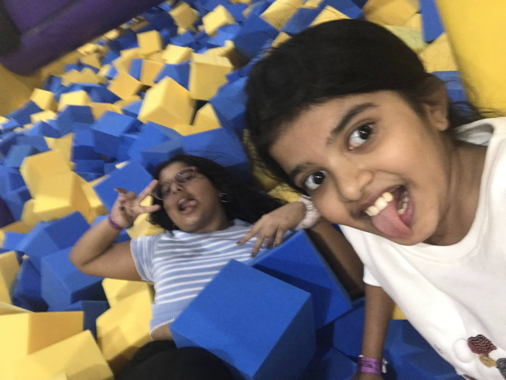
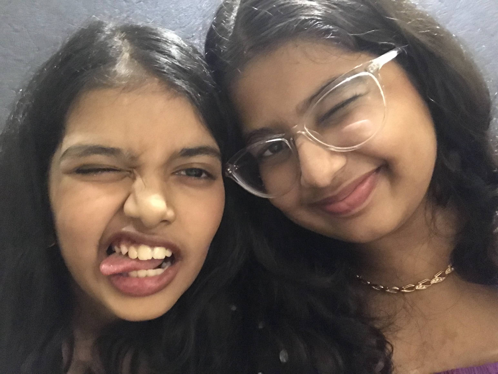
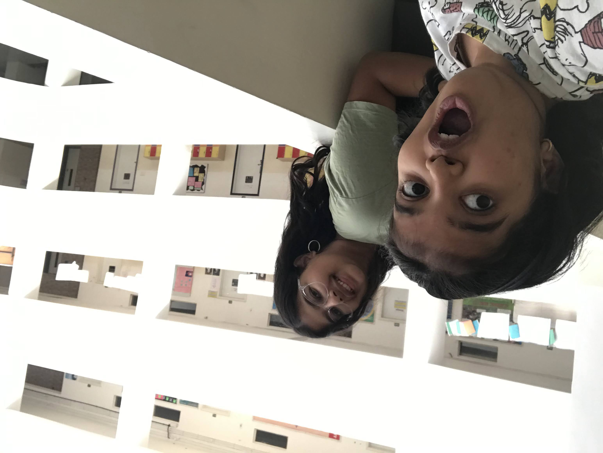
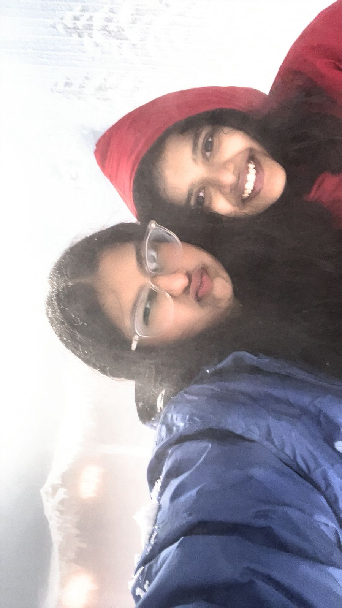
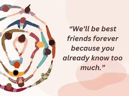

<html lang="en">
<head>
<meta charset="UTF-8">
<title>For Ira</title>

<link href="https://fonts.googleapis.com/css2?family=Great+Vibes&display=swap" rel="stylesheet">

</head>

<body>

<!-- PASSWORD -->
<section id="lock" class="active">
    <h1>Enter something only we know</h1>
    <input type="password" id="pass">
    
Hint: Who is better for Akanksha??

    <button onclick="check()">Enter</button>
</section>

<!-- MAIN -->

<section id="s1">
    <h1 id="typing"></h1>
    <button onclick="next('s2')">Continue</button>
</section>

<section id="s2">
    
You changed my life in a way I never expected.

    <button onclick="reveal('m1')">Tap to reveal</button>
    
    <button onclick="next('s3')">Continue</button>
</section>

<section id="s3">
    
You became the person I go to without thinking.

    <button onclick="reveal('m2')">Tap to reveal</button>
    
    <button onclick="next('s4')">Continue</button>
</section>

<section id="s4">
    
These moments meant everything.

    <video controls>
        <source src="Ira Video.mp4" type="video/mp4">
    </video>
    <button onclick="next('s5')">Continue</button>
</section>

<section id="s5">
    
It is the small moments that became everything.

    <button onclick="reveal('m3')">Tap to reveal</button>
    
    <button onclick="next('s6')">Continue</button>
</section>

<section id="s6">
    
You are not just my best friend. You are my safe place.

    <button onclick="reveal('m4')">Tap to reveal</button>
    
    <button onclick="next('quiz')">Last</button>
</section>

<!-- QUIZ -->
<section id="quiz">
    <h1>One last thing...</h1>
    
Guess what I got you

    <button onclick="checkGift('chocolate')">Chocolate</button>
    <button onclick="checkGift('bracelet')">Bracelet</button>
    <button onclick="checkGift('flowers')">Flowers</button>
    <button onclick="checkGift('handmade')">Handmade gift</button>

    

</section>

<!-- FINAL -->
<section id="end">
    <h1 id="countdown"></h1>

    <h1 id="finalText" style="display:none;">
        It was never just a gift.  
        It is something I made for you.
    </h1>

    <button onclick="reveal('m5')" id="finalBtn" style="display:none;">Tap to reveal</button>
    

</section>

<!-- MUSIC -->
<audio id="music">
    <source src="London Thumakda .mp3" type="audio/mpeg">
</audio>

</body>
</html>
