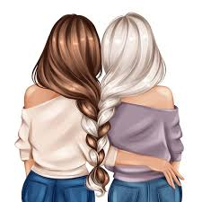

<html lang="en">
<head>
<meta charset="UTF-8">
<title>For Ira</title>

<link href="https://fonts.googleapis.com/css2?family=Great+Vibes&family=Poppins:wght@300;500&display=swap" rel="stylesheet">

</head>

<body>

<!-- PASSWORD -->
<section id="lock" class="active">
<h1>This is not just a website</h1>

It is something I made for you

<input type="password" id="pass">

Hint: Who is better for Akanksha over Yogesh??

<button onclick="check()">Enter</button>
</section>

<!-- MAIN -->

<section id="s1">
<h1 id="typing"></h1>
<button onclick="next('s2')">keep going</button>
</section>

<section id="s2">

I don’t think I ever said this properly So I made this instead

<button onclick="reveal('m1')">tap to reveal</button>

<button onclick="next('s3')">there’s more</button>
</section>

<section id="s3">

You didn’t change my life all at once It happened slowly

<button onclick="reveal('m2')">tap to reveal</button>

<button onclick="next('s4')">wait</button>
</section>

<section id="s4">

These moments meant more than I ever said

<video controls>
<source src="Ira Video.mp4" type="video/mp4">
</video>
<button onclick="next('s5')">one more</button>
</section>

<section id="s5">

You became the person I go to without thinking

<button onclick="reveal('m3')">tap to reveal</button>

<button onclick="next('s6')">almost there</button>
</section>

<section id="s6">

There are so many things I never say But I hope you feel them

<button onclick="reveal('m4')">tap to reveal</button>

<button onclick="next('quiz')">wait</button>
</section>

<!-- QUIZ -->
<section id="quiz">
<h1>Wait</h1>

Guess your gift

<input type="text" id="guess">
<button onclick="checkGift()">Submit</button>

</section>

<!-- CHAT -->
<section id="chat">

why are you being like this

because you deserve to hear it

this is weird

maybe

but it’s true

<button onclick="next('end')">continue</button>
</section>

<!-- FINAL -->
<section id="end">
<h1 id="finalText"></h1>

<button onclick="reveal('m5')">tap to reveal</button>

<button onclick="location.reload()">Replay</button>
</section>

<!-- MUSIC -->
<audio id="music">
<source src="London Thumakda .mp3" type="audio/mpeg">
</audio>

</body>
</html>
