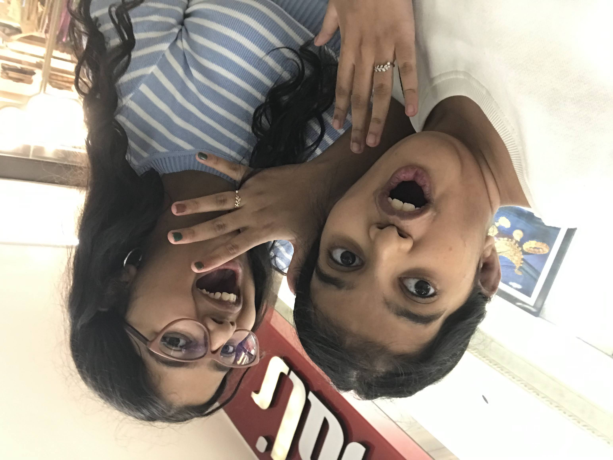

<html lang="en">
<head>
<meta charset="UTF-8">
<title>For Ira</title>

<!-- FONTS -->
<link href="https://fonts.googleapis.com/css2?family=Great+Vibes&family=Poppins:wght@300;400&display=swap" rel="stylesheet">

</head>

<body>

<!-- PASSWORD -->
<section id="lock" class="active">
    <h1>This is not just a website</h1>
    
It is something I made for you

    <input type="password" id="pass">
    

        Hint: Who is better for Akanksha over Yogesh???
    

    <button onclick="check()">Enter</button>
</section>

<!-- MAIN -->

<section id="s1">
    <h1 id="typing"></h1>
    <button onclick="next('s2')">Continue</button>
</section>

<section id="s2">
    
You changed my life in a way I never expected.

    <button onclick="reveal('m1')">Tap to reveal memory</button>
    
    <button onclick="next('s3')">Continue</button>
</section>

<section id="s3">
    
You became the person I go to without thinking.

    <button onclick="reveal('m2')">Tap to reveal memory</button>
    
    <button onclick="next('s4')">Continue</button>
</section>

<section id="s4">
    
These moments meant more than I ever said.

    <video controls>
        <source src="Ira Video.mp4" type="video/mp4">
    </video>
    <button onclick="next('s5')">Continue</button>
</section>

<section id="s5">
    
It is not just the big memories. It is everything in between.

    <button onclick="reveal('m3')">Tap to reveal memory</button>
    
    <button onclick="next('s6')">Continue</button>
</section>

<section id="s6">
    
You are not just my best friend. You are my safe place.

    <button onclick="reveal('m4')">Tap to reveal</button>
    
    <button onclick="next('end')">Last</button>
</section>

<!-- FINAL -->
<section id="end">
    <h1 id="finalText"></h1>

    <button onclick="reveal('m5')">Tap to reveal</button>
    

    <button onclick="location.reload()">Replay</button>
</section>

<!-- MUSIC -->
<audio id="music">
    <source src="London Thumakda .mp3" type="audio/mpeg">
</audio>

</body>
</html>
